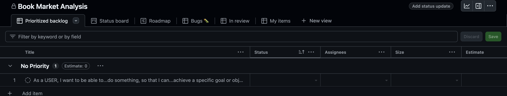
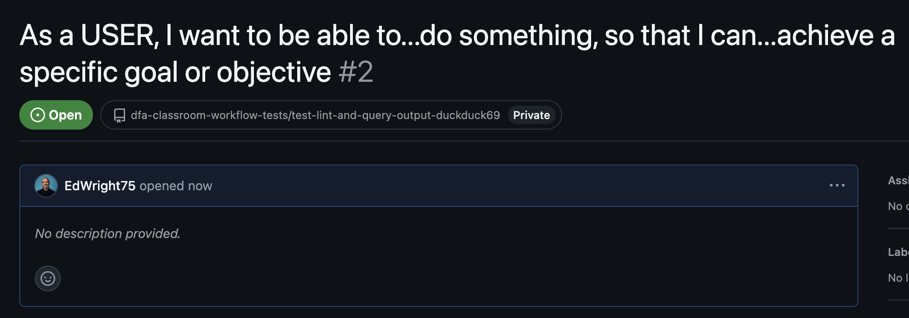
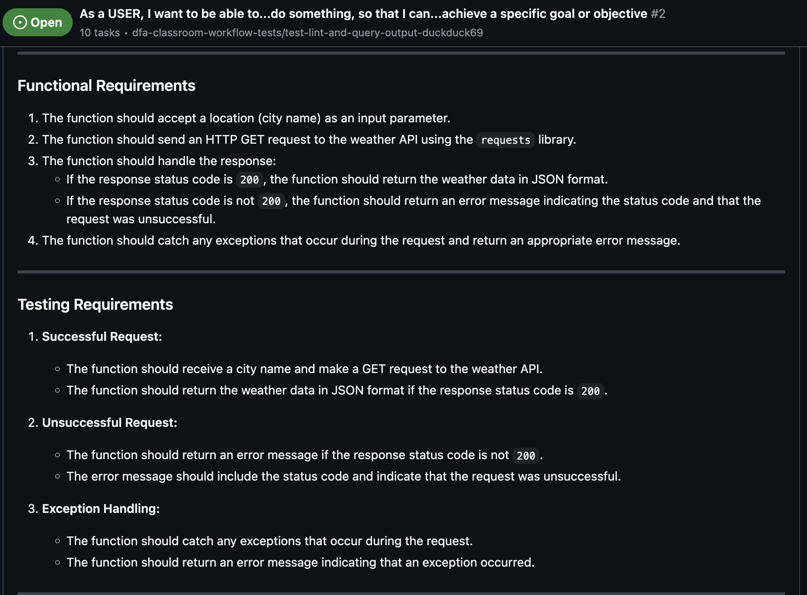

# 

## Python for Extracting

### Understanding the Problem

In this activity, you will practice breaking a problem down to help create a successful solution.  

To do this, you should think about the problem in terms of the following:

- **Inputs**: What data is required to solve the problem?
- **Outputs**: What is the expected result?
- **Processes**: What steps are required to solve the problem?
- **Errors**: What could go wrong?
- **Testing**: How will you know if the solution is correct?
- **Documentation**: How will you explain the solution to others?

---

## Customer's Requirements

> I would like to understand the market for books in different categories and understand the price point of books in each category.  
> This will help me to make decisions about which categories to focus on when launching a rival business.  
> I have come across a website that has a lot of data about books that I would like to use for this analysis.  
> The website address <http://books.toscrape.com/>.

This is a relatively simple request on the face of it but there are a number of steps that need to be taken to achieve this.

---

## Activity 1.1 - Breaking Down the Problem

Creating a solution to this problem will involve a number of steps.  To help you understand the problem, you should break it down into smaller parts.  These should take the form of **User Stories**

### Task - User Stories

- Discuss the problem with your team and create a list of user stories that break the problem down into smaller parts, to this:
  - From your GitHub repo, access the `Projects` tab and create a new project called `Book Market Analysis - <YOUR NAMES>` using the **Feature release**
  - Click `Add item` or press `Control + Space` to add a new user story

---



---

HINTS:

- There are 2 user stories here! (You may need to ask the customer (i.e. your trainer) for clarity on the requirements)
- Each user story should be a small, manageable piece of work that can be completed in a short amount of time (usually well within the sprint timebox)
- Each user story should be written from the perspective of the user (in this case, the customer)

```plaintext
As a USER  
I want to be able to...do something  
So that I can...achieve a specific goal or objective
```

---

## Activity 1.2 - Breaking Down the Problem Further

Now you have your user stories, you should break them down further into tasks.  These tasks should be small, manageable pieces of work that can be completed in a short amount of time (usually within a day, so that you can report what has been "done" in the next stand-up meeting).

### Task - Tasks

- In your project, click on the user story you created in the previous activity
- In the bottom left of the pop-up window, click `Convert to issue` and choose your team's repository
- Then edit the issue to add the tasks that will help you to complete the user story (click the `...` button at the top right of the window and choose `Edit`)
  - It is often useful to use Markdown notation here and create a checklist of tasks that can be ticked off as you complete them

---



---


---

HINTS:

- Tasks should include things like:
  - Create and test a function to make a request to the website
  - Create and test a function to parse the response
  - Create and test a function to extract the data
  - Create and test a function to save the data for processing

---

## Activity 1.3 - Breaking Down the Problem Even Further

Now you have your tasks, how will you know that you have been successful?  This is where you think about the functionality and what you expect to happen when you run your code.

### Tasks - Functional Requirements and Testing

- Continuing in the same issue, add a new section called `Functional Requirements`
  - Define the functionality that you expect from the code you will write
- Add a new section called `Testing` and a sub heading for each function you will create
- Under each sub heading, add a list of test cases that you will use to test the function
  - These should include both positive and negative test cases
  - You should also include any edge cases that you can think of

e.g.

> **FOR THE MOMENT, DO THIS FOR JUST THE FIRST FUNCTION**

**HINTS for the first function:**

- How do you know that the function is using the correct URL?
- What should happen when a request is made to the website?
  - What happens if an expected response is returned?  What even is an expected response?
  - What happens if the website cannot find the URL you are requesting?
  - What happens if the website is down?

Here is an example of what this might look like:

```markdown
## New Functionality: Fetch Weather Data from API

### Problem Definition

As a software developer, I need a function that can send an HTTP GET request to a weather API and handle the response. This function will be a fundamental part of our weather data retrieval application, allowing us to fetch current weather information for a specified location.

### Functional Requirements

1. The function should accept a location (city name) as an input parameter.
2. The function should send an HTTP GET request to the weather API using the `requests` library.
3. The function should handle the response:
   - If the response status code is `200`, the function should return the weather data in JSON format.
   - If the response status code is not `200`, the function should return an error message indicating the status code and that the request was unsuccessful.
4. The function should catch any exceptions that occur during the request and return an appropriate error message.

### Testing Requirements

1. **Successful Request:**
   - The function should receive a city name and make a GET request to the weather API.
   - The function should return the weather data in JSON format if the response status code is `200`.

2. **Unsuccessful Request:**
   - The function should return an error message if the response status code is not `200`.
   - The error message should include the status code and indicate that the request was unsuccessful.

3. **Exception Handling:**
   - The function should catch any exceptions that occur during the request.
   - The function should return an error message indicating that an exception occurred.

### Definition of Done

- [ ] The function is implemented according to the functional requirements.
- [ ] Unit tests are written to cover all testing requirements.
- [ ] The function and tests are reviewed and approved by at least one peer.
- [ ] The function is documented with clear and concise comments.
- [ ] The code adheres to PEP 8 guidelines and Python best practices.
```

---



---

## Activity 1.4 - Getting it DONE

The final part of a properly documented user story is a definition of done.  This is a list of criteria that must be met before the user story can be considered complete.

### Tasks - Definition of Done

- Continuing in the same issue, add a new section called `Definition of Done`
- Add a list of criteria that must be met before the user story can be considered complete
  - This should include things like (and in this instance should include...):
    - All tests pass
    - Code is reviewed
    - Documentation is updated
    - Code is merged into the main branch

---


---

## Summary

All this and not a single line of production (or test code written)...  

...but we do have a really clear idea of what we need to do, why and how we will know when we have done it!

---

|---> Next ---> [Making a Request](02-making-a-request.md)
