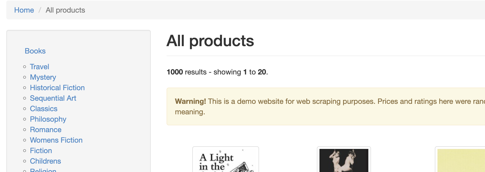
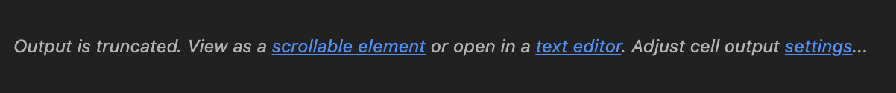

# 

## Python for Extracting

### Extracting the Category List from the HTML

We will use an HTML Parser to extract the data from the HTML and convert it into workable Python objects. The most popular library for this is [Beautiful Soup](../info/beautiful-soup.md).

---

## Customer's Requirements

> I would like to understand the market for books in different categories and understand the price point of books in each category.  
> This will help me to make decisions about which categories to focus on when launching a rival business.  
> I have come across a website that has a lot of data about books that I would like to use for this analysis.  
> The website address <http://books.toscrape.com/>.

This is a reminder of the customer's requirements.  In the previous activity, you developed the code to make a request for a URL and check that it returns a valid response.  
In this activity, you will extract the data from the HTML that is returned.  
As we are not sure what the actual HTML looks like, we will need to inspect the HTML to understand the structure before we can do any testing!

---

## User Stories

> As a BOOK STORE OWNER,  
> I want to understand how may books are available in each category from [http://books.toscrape.com/],  
> So that I can make decisions about which categories to focus on when launching a rival business

***AND***

> As a BOOK STORE OWNER,  
> I want to understand the average price point of books in each category from [http://books.toscrape.com/],  
> So that I can make decisions about the price point of different books for each category

---

### Extracting the Data from HTML requests - User Story 1

> In the initial instance, we will focus on extracting the data about the number of books in each category.

### Functional Requirements

1. [ ] The function should query the supplied website using the result of the previously developed `request_to_scrape` function.
2. [ ] The function should return a dictionary, where the keys are the category names, populated with dictionaries where the link is a key and the value is the category URL.
3. [ ] The function should catch any exceptions that occur during the processing and return an appropriate error message, including not finding any relevant data in the HTML.

### Testing Requirements

1. **Successful Parse:**
   - [ ] The function should return a dictionary, populated with dictionaries where the category name is the key and the value is a dictionary with the link as a key and the value is the category URL.
2. **No Data Parse:**
   - [ ] The function should return an error message if no categories are found in the HTML for the website.
3. **Exception Handling:**
   - [ ] The function should return an error message if an exception occurs during the processing.

### Definition of Done

- [ ] The function is implemented according to the functional requirements.
- [ ] Unit tests are written to cover all testing requirements.
- [ ] The function and tests are reviewed and approved by at least one peer.
- [ ] The function is documented with clear and concise comments.
- [ ] The code adheres to PEP 8 guidelines and Python best practices.
- [ ] The function and tests are committed to the repository and pass all CI checks.
- [ ] The functionality is demonstrated and verified in a development environment.

> Notice how this "Definition of Done" is identical to the one in the previous activity.  
> This is common in Agile development, where the "Definition of Done" is consistent across all tasks.  
> It helps engineers produce consistent quality code and ensures that all tasks are completed to the same standard.  
> The functional requirements may have changed but the requirements for testing, documentation, and code quality remain the same.

---

## Activity 3 - Prototype the Data Extraction Function

In this activity, you will prototype the function to extract the data about the number of books in each category.

> Remember, we don't know what the HTML looks like yet, so we can't define the functionality we need in detail and therefore can't test-drive the development.

You will start by continuing development in your previous Jupyter Notebook.

### Task 9 - Obtain the HTML

1. Under the existing block of `# request_to_scrape Production Code` add a ***new*** **Python** cell
   - this will contain your `extract_book_categories Production Code` code (in fact, put that as a comment AND in a markdown block above it to help identify it!)
2. Import the `BeautifulSoup` class from the `bs4` module at the top of the cell
3. Create a function called `extract_book_categories` that accepts the HTML content (a *string*) as a parameter and `site` (a *string*) as a second parameter
4. In the function, add a variable called `soup` and assign this is a call to the `BeautifulSoup` class with the `html` variable passed in and the parser `html.parser` as the second argument
5. `print` the result of the `soup.prettify()` method

**Code to execute the function:**

1. In the cell `# Production Execution Code`
2. Define a variable called `site` setting this to a string for the URL of the website (`http://books.toscrape.com`)
3. Define another variable called `home_page` and set this to the result of a call to the `request_to_scrape` function with the `site` variable passed in
4. In a separate cell, call the `extract_book_categories` function with `home_page['data']` as the first function argument and `site` as the second
   - We don't want to make the request each time and the `home_page['data']` isn't going to change so we can store this and reuse it in the Jupyter Notebook
5. Run the cell to execute the code

> Your output of the Beautiful Soup Production Code should be the HTML that is used to make the site homepage.
>
> This will allow you to inspect the HTML and understand the structure of the data you need to extract.
>
> You can then use this information to define the functionality you need to extract the data.
>
> This is a common approach when working with web scraping as you often need to understand the structure of the HTML before you can define the functionality you need to extract the data.
>
> This is why we are prototyping here rather than using test-driven development

---

### Task 10 - Explore the HTML to find the Category List - create an `extract_element` function



> Examining the actual web page is a good place to start to help identify the likely structure of the HTML so you can extract the category data.  
> From this web page, we can deduce a number of things about the category list:
>
> 1. It is in a side-bar of some sort
> 2. It appears to be an unordered list of items
> 3. The actual text is a link - which means it also has an associated URL to get to the category's page where it's books live
>
> Knowing this we can examine the HTML code, being on the look out for `<ul><li><a>` tag that appear to be in some form of sidebar

1. Examine the HTML output, you may be invited to expand the output - in this case click, click the `text editor` link



2. Find the section that you think contains the category list navigation bar:

> This section of code seems to contain what we need:

```HTML
<aside class="sidebar col-sm-4 col-md-3">
      <div id="promotions_left">
      </div>
      <div class="side_categories">
       <ul class="nav nav-list">
        <li>
         <a href="catalogue/category/books_1/index.html">
          Books
         </a>
         <ul>
          <li>
           <a href="catalogue/category/books/travel_2/index.html">
            Travel
           </a>
          </li>
          <li>
          ...
```

> What we are actually interested in extracting is the the category names inside the inner `<ul>` and the `href` of the page that contains the display of books. (This is so we can then get a list of the books in each category and ultimately how many there are!)

**Code to extract an element:**

1. Create a new code cell with a markdown title and a comment of `# extract_element Production Code` cell.
2. Import `BeautifulSoup` at the top of the cell (not necessary when working in a Notebook but will help when making **.py** files later!)
3. Create a new function called `extract_element` that accepts `soup` as a parameter (that will be a BeautifulSoup HTML parse object) as well as a *string* that represents an element called `tag` and a *string* that represents the class(es) of the element to find called `class_name`, defaulting to `None`
   - Make this function return the result of calling ***BeautifulSoup***'s `find` method
     - If a `class_name` exists, call `find` to with the `tag` and `class_` arguments set to `class_name`

4. In the `extract_book_categories` function, call the `extract_element` function with the `soup` object as the argument, along with `'ul'` and `'nav nav-list'`  and store the result in a variable called `nav_list`

5. Modify the print statement so that it outputs the section of the HTML we are interested in.

> If you have done this correctly, you should get an output that starts with:

```html
<ul class="nav nav-list">
 <li>
  <a href="catalogue/category/books_1/index.html">
   Books
  </a>
  <ul>
   <li>
    <a href="catalogue/category/books/travel_2/index.html">
     Travel
    </a>
   </li>
   <li>
    <a href="catalogue/category/books/mystery_3/index.html">
     Mystery
    </a>
   </li>
   ...
```

---

### Task 11 - Isolate the Actual Categories - reuse `extract_element`

1. Call the `extract_element` function in the `extract_book_categories` function using `nav_list` object as the first argument and `'ul'` as the second
    - store the result in a variable called `category_list`
2. Print the result of the `category_list.prettify()` method to check that you have isolated the correct section of the HTML

> Now we should just have the `<ul>` that has the `<li>` elements that contain the `<a>` elements with the category titles and the `href` to the page that contains the category's book list!

```html
<ul>
 <li>
  <a href="catalogue/category/books/travel_2/index.html">
   Travel
  </a>
 </li>
 <li>
  <a href="catalogue/category/books/mystery_3/index.html">
   Mystery
  </a>
 </li>
 <li>
  <a href="catalogue/category/books/historical-fiction_4/index.html">
   Historical Fiction
  </a>
 </li>
 <li>
  <a href="catalogue/category/books/sequential-art_5/index.html">
   Sequential Art
  </a>
 </li>
 <li>
  <a href="catalogue/category/books/classics_6/index.html">
   Classics
  </a>
...
 </li>
</ul>
```

---

### Task 12 - Create a Dictionary with the Category Title and Link Address - create `extract_categories_and_links`

1. Under the last code cell, create a markdown block and a new Python code cell with the title `# extract_categories_and_links Production Code` cell.
2. Create a new function called `extract_categories_and_links` that takes `category_list` and `site` as arguments
3. In the function, create an empty dictionary called `categories`

> We will not loop through the `category_list` object to extract the category name and the link address

```HTML
<a href="catalogue/category/books/travel_2/index.html">
 Travel
</a>

<a href="catalogue/category/books/mystery_3/index.html">
 Mystery
</a>

<a href="catalogue/category/books/historical-fiction_4/index.html">
 Historical Fiction
</a>

<a href="catalogue/category/books/sequential-art_5/index.html">
 Sequential Art
</a>

<a href="catalogue/category/books/classics_6/index.html">
 Classics
</a>

<a href="catalogue/category/books/philosophy_7/index.html">
 Philosophy
</a>

<a href="catalogue/category/books/romance_8/index.html">
...
 Crime
</a>
```

3. Loop through the `category_list` by calling `.find_all('a')` on it, calling each item `link`
4. Get the text for the name of the category and the link address and store them in variables
   - For the category name, you will need to use beautiful soup's `get_text()` method, passing `strip=True` to remove any leading or trailing whitespace
   - To get the link address, you can use the call `.get('href')` on the `link` object
5. Set `categories[category_name]` to a dictionary with the key `link` and the value of `f"{site}/{category_href}"`

> Why do we need to add the site url to the link address?

6. Return the `categories` dictionary from the function (outside of the loop!)
7. Call the `extract_categories_and_links` function in the `extract_book_categories` function with the `category_list` object as the first argument and `site` as argument 2 and store the result in a variable called `categories`
8. Return `categories` from the `extract_book_categories` function

#### Retrofit the site url to calls

> We have added a previously undefined `site` variable to the `extract_categories_and_links` function.
>
> This will need to be supplied from the top level call to `extract_book_categories` function.

- In the ***execution code***, add a second argument of `site` to the `extract_book_categories` function call
  - This will use the site variable defined at the start of the Execution Scripts
- Add a second argument to the `extract_book_categories` function named `site`
  - This will simply be passed through to the `extract_categories_and_links` function

- Print this to check the output (perhaps creating a loop to print each category using `for category in categories.items()` - this will ultimately be removed)

1.

> TOP TIP: Put the call to `extract_categories_and_links` in a new cell so that you don't need to scrape the site again if you need to make changes to the function!

```txt
('Travel', {'link': 'http://books.toscrape.com/catalogue/category/books/travel_2/index.html'})
('Mystery', {'link': 'http://books.toscrape.com/catalogue/category/books/mystery_3/index.html'})
('Historical Fiction', {'link': 'http://books.toscrape.com/catalogue/category/books/historical-fiction_4/index.html'})
('Sequential Art', {'link': 'http://books.toscrape.com/catalogue/category/books/sequential-art_5/index.html'})
('Classics', {'link': 'http://books.toscrape.com/catalogue/category/books/classics_6/index.html'})
('Philosophy', {'link': 'http://books.toscrape.com/catalogue/category/books/philosophy_7/index.html'})
('Romance', {'link': 'http://books.toscrape.com/catalogue/category/books/romance_8/index.html'})
('Womens Fiction', {'link': 'http://books.toscrape.com/catalogue/category/books/womens-fiction_9/index.html'})
('Fiction', {'link': 'http://books.toscrape.com/catalogue/category/books/fiction_10/index.html'})
('Childrens', {'link': 'http://books.toscrape.com/catalogue/category/books/childrens_11/index.html'})
('Religion', {'link': 'http://books.toscrape.com/catalogue/category/books/religion_12/index.html'})
('Nonfiction', {'link': 'http://books.toscrape.com/catalogue/category/books/nonfiction_13/index.html'})
('Music', {'link': 'http://books.toscrape.com/catalogue/category/books/music_14/index.html'})
('Default', {'link': 'http://books.toscrape.com/catalogue/category/books/default_15/index.html'})
('Science Fiction', {'link': 'http://books.toscrape.com/catalogue/category/books/science-fiction_16/index.html'})
('Sports and Games', {'link': 'http://books.toscrape.com/catalogue/category/books/sports-and-games_17/index.html'})
('Add a comment', {'link': 'http://books.toscrape.com/catalogue/category/books/add-a-comment_18/index.html'})
('Fantasy', {'link': 'http://books.toscrape.com/catalogue/category/books/fantasy_19/index.html'})
('New Adult', {'link': 'http://books.toscrape.com/catalogue/category/books/new-adult_20/index.html'})
('Young Adult', {'link': 'http://books.toscrape.com/catalogue/category/books/young-adult_21/index.html'})
('Science', {'link': 'http://books.toscrape.com/catalogue/category/books/science_22/index.html'})
('Poetry', {'link': 'http://books.toscrape.com/catalogue/category/books/poetry_23/index.html'})
('Paranormal', {'link': 'http://books.toscrape.com/catalogue/category/books/paranormal_24/index.html'})
('Art', {'link': 'http://books.toscrape.com/catalogue/category/books/art_25/index.html'})
('Psychology', {'link': 'http://books.toscrape.com/catalogue/category/books/psychology_26/index.html'})
...
('Politics', {'link': 'http://books.toscrape.com/catalogue/category/books/politics_48/index.html'})
('Cultural', {'link': 'http://books.toscrape.com/catalogue/category/books/cultural_49/index.html'})
('Erotica', {'link': 'http://books.toscrape.com/catalogue/category/books/erotica_50/index.html'})
('Crime', {'link': 'http://books.toscrape.com/catalogue/category/books/crime_51/index.html'})
```

---

[Making a Request](02-making-a-request.md) <--- Previous <---|---> Next [Testing the Category List Extraction Functions](./04-testing-the-extract-categories.md)--->
