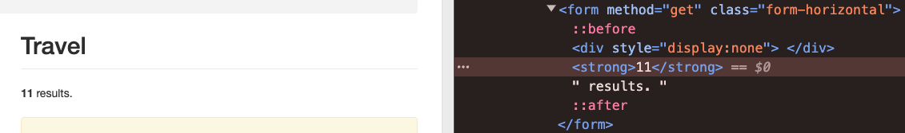

# 

## Python for Extracting

### Activity 5 - Compiling the Category Data

We can now reach all of HTML that contains the data we want to meet the customer's requirements but we still need to extract the data so we can make it ready for analysis.

To do this, we'll need to write some more functions, using BeautifulSoup again, so that we can get the data about the books in each category and their price.

---

## Customer's Requirements

> I would like to understand the market for books in different categories and understand the price point of books in each category.  
> This will help me to make decisions about which categories to focus on when launching a rival business.  
> I have come across a website that has a lot of data about books that I would like to use for this analysis.  
> The website address <http://books.toscrape.com/>.

This is a reminder of the customer's requirements.  In the previous activity, you developed the code to make a request for the category names and links.  
In this activity, you will extract the data by visiting each link and extracting the book data and returning this.  
As we are not sure what the actual HTML looks like, we will need to inspect the HTML to understand the structure before we can do any testing!

---

## User Stories

> As a BOOK STORE OWNER,  
> I want to understand how may books are available in each category from [http://books.toscrape.com/],  
> So that I can make decisions about which categories to focus on when launching a rival business

***AND***

> As a BOOK STORE OWNER,  
> I want to understand the average price point of books in each category from [http://books.toscrape.com/],  
> So that I can make decisions about the price point of different books for each category

---

## Strategy

In the interests of code reuse and building some flexibility into how users of the data can access it, it makes sense to break this part of the code by creating more functions!  Here is a general overview of the strategy:

1. Work with a single category to develop this code.
2. Create a function to scrape the home page of the category, get the number of books and the category's book data (if required).  The function will:
   - Take an argument of the URL for the category home page and a boolean to determine if the book data is required.
   - Make a request for the category homepage and return the HTML.
   - Scrape the number of books in the category and add it to the category dictionary.
   - Return the updated dictionary.
3. Write tests for these functions.
4. Amend the production code to call these functions.

> Alternatively, we could have used a "top-down" strategy where we would looped through the categories and then written functions as we go to extract the data that we want.
>
> Both approaches are valid!

---

### Activity 5.1 - Extract Category Data - Scrape Category Home Page

#### Task 16 - Make a function to start the process with a single category

1. Add a new cell under the last `# Python Execute Code` cell
2. Define a variable called `category_data` and set it to be the result of calling `extract_categories_data` with `categories['Travel']` as the argument for the moment.
3. Create a new cell under the last `# Python Execute Code` cell with a markdown heading `extract_category_data Production Code` (and a comment in the code cell).
4. Define the function `extract_category_data` which takes a single argument of `category` and an optional argument of `get_book_data` set to `False`.

> Let's just check we have the right data first...

5. Print the passed in `category` dictionary and return it.
6. Run all of the ***new*** code cells and see the output under the execution code cell:

```text
{'link': 'http://books.toscrape.com/catalogue/category/books/travel_2/index.html'}
```

#### Task 17 - Get the HTML for the Category Page

1. Define a variable called `category_page` and set it to the result of calling `request_to_scrape` with `category['link']` as the argument.
   - You can comment out the printing of the category dictionary now!
2. Make sure the cell imports `BeautifulSoup` and define `soup` to be a call to it, passing in `category_page['data']` and `HTML_PARSER` (defined in constants) as the arguments.

> Let's just check we have the page HTML OK before going any further...

1. Print the `soup` object using `prettify()`
2. Run this cell and the *execution code cell* for this function to see the output.

> If you've done this correctly, you should see the HTML for the category page displayed in a structured format.
>
> Let's inspect the webpage to see what we need to extract...
>
> 
>
> It appears we need to extract the contents of the `<strong>` element that is a child of a `<form>` element with the class `form-horizontal` to get the number of books in the category.
>
> We've done this type of thing before, so we can reuse the code we've already written!

#### Task 18 - Extract the Number of Books in the Category

> This time we are looking for the HTML that displays the books in the category so we need to find the containing element, so we can reuse the extract functions we wrote earlier.
>
> Examine the code in a text editor - how easy is it to identify what you need?
>
> Using the browser and the developer tools here can be a big help...
>
> You can access the developer tools in any browser through the `F12` key or by right-clicking on the page and selecting `Inspect` from the context menu.
>
> Helpfully, the website actually displays the number of results, so we could simply return this value to get the number of books in each category!
>
> Let's get that form element...

1. Define a variable called `form` and set it to the result of calling `extract_element` with `soup`, `'form'`, and `'form-horizontal'` as arguments.
   - Print `form` in the function, run this cell and the *execution code cell* for this function to see the output:

```html
<form class="form-horizontal" method="get">
   <div style="display:none">
   </div>
   <strong>
      11
   </strong>
   results.
</form>
```

2. Define a variable called `books_in_category` and set it to a call `extract_element` with `form`, `'strong'` as arguments and chain a call to `get_text(strip=True)` to the end of it, casting it to an `int`.
3. Return this value
   - Print the result of this in the function, run this cell and the *execution code cell* for this function to see the output:

```text
11
```

> This seems to be a separate bit of functionality, so lets put it in its own function

1. Under the `extract category data` cell, define a new cell called `extract_number_in_category Production Code`.
2. Define a function called `extract_number_in_category` which takes a single argument of `category_page`.
3. Move the line of code that declare `form` and `number_of_books` into this function.
4. Make the function return `number_of_books`.
5. In `extract_category_data`, set `number_in_category` to the result of calling `extract_number_in_category` with `soup` as the argument.
   - Leave the printing of `number_in_category` in the function for now.
6. Run all of the cells to see the output.

> You should still see `11` as the output.

#### Task 19 - Add the Number of Books to the Category Data

1. In the `extract_category_data` function, set the value of `category['number_of_books']` to `number_of_books`.
   - Print the `category` dictionary to see the output (instead of the number of books)
2. Make the function return the updated `category` dictionary.

> You should have an extra key in the dictionary with the value of `11` for the number of books.

```text
{'link': 'http://books.toscrape.com/catalogue/category/books/travel_2/index.html', 'number_of_books': 11}
```

---

### Task 20 - Testing the Functions

You should write the following tests here:

1. **Valid Input:** Ensure the function correctly updates the category dictionary with the number of books, when some valid HTML is passed in.
2. **Empty Category Dictionary:** Ensure the function handles an empty dictionary gracefully.
3. **Invalid Category Page Data:** Ensure the function handles cases where the category page data is invalid or does not contain the expected information.
4. **Valid Category Page Data:** Ensure the function handles cases where the category page data is valid but does not contain the expected information (e.g. a value that cannot be cast to an integer).

> Some of this testing will be done as part of testing `extract_number_in_category`, some tests may need to be written in the `extract_category_data` function and some may be needed for both!  You decide...

---

### Task 21 - Get the Data for All Categories

This is relatively simple in our execution code:

- **Loop Through the Categories:** This is the simplest way to do this, but it is not the most efficient.  It is also the easiest to understand.

Also, we should consider that we don't want any logic in our ***execution*** code, so if we introduce any we should consider writing a function to execute this.

---

## USER STORY 1 - DONE?

> As a BOOK STORE OWNER,  
> I want to understand how may books are available in each category from [http://books.toscrape.com/](http://books.toscrape.com/),  
> So that I can make decisions about which categories to focus on when launching a rival business

### Definition of Done

- [ ] The function is implemented according to the functional requirements.
- [ ] Unit tests are written to cover all testing requirements.
- [ ] The function and tests are reviewed and approved by at least one peer.
- [ ] The function is documented with clear and concise comments.
- [ ] The code adheres to PEP 8 guidelines and Python best practices.

[Testing the Category List Extraction Functions](./04-testing-the-extract-categories.md) <--- Previous <---|---> Next [Getting the Book Data](./06-getting-the-book-data.md) --->